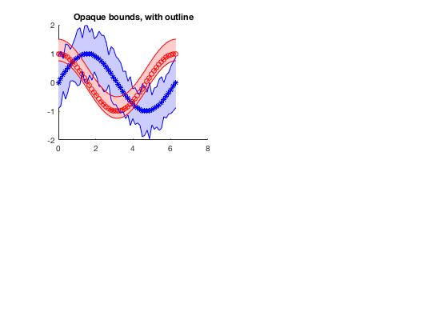
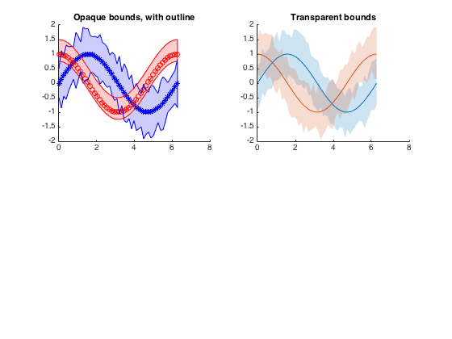
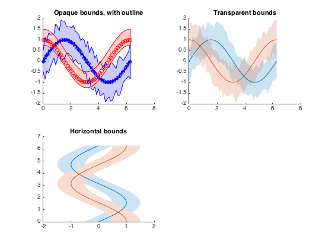
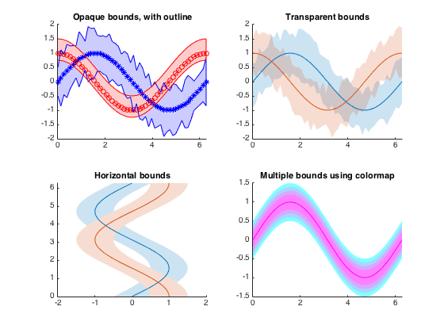

## boundeline.m Documentation

The boundedline function is a Matlab utility to plot error bounds, confidence intervals, etc. for a line or lines.  Advantages include:
- allows x-y input similar to plot, where one call can create multiple lines at once, either by listing consecutive x-y pairs or by using using matrices for x and/or y.
- can add bounds in either the x- or y-direction, leading to support of plots where the x axis represents the dependent variable
- can render the shaded bounds either with transparency or as a lighter opaque patch, allowing flexibility with different renderers (helpful when OpenGL acts up, as it often does on my own computer).
- Can use linespec definitions, a colormap, or the default color order, as well as varying color intensity for the shaded bounds, for flexible color of lines and bounds
- returns handles of lines and patches for future modification if necessary

### Syntax

```
[hl, hp] = boundedline(x, y, b)
[hl, hp] = boundedline(x, y, b, linespec)
[hl, hp] = boundedline(x1, y1, b1, linespec1,  x2, y2, b2, linespec2)
[hl, hp] = boundedline(..., 'alpha')
[hl, hp] = boundedline(..., ax)
[hl, hp] = boundedline(..., 'transparency', trans)
[hl, hp] = boundedline(..., 'orientation', orient)
[hl, hp] = boundedline(..., 'cmap', cmap)
```

See function help for description of input and output variables.

### Examples

Plot with opaque bounds.  In this example, the bounds on the first line
vary over x, while the bounds on the second line are constant for all x.
An outline is added to the bounds so the overlapping region can be seen
more clearly.

```matlab
x = linspace(0, 2*pi, 50);
y1 = sin(x);
y2 = cos(x);
e1 = rand(size(y1))*.5+.5;
e2 = [.25 .5];

ax(1) = subplot(2,2,1);
[l,p] = boundedline(x, y1, e1, '-b*', x, y2, e2, '--ro');
outlinebounds(l,p);
title('Opaque bounds, with outline');
```



For our second axis, we use the same 2 lines, and this time assign
x-varying bounds to both lines.  Rather than using the LineSpec syntax,
this  example uses the default color order to assign the colors of the
lines and patches. 

```matlab
ax(2) = subplot(2,2,2);
boundedline(x, [y1;y2], rand(length(y1),2,2)*.5+.5, 'alpha');
title('Transparent bounds');
```



The bounds can also be assigned to a horizontal orientation, for a case
where the x-axis represents the dependent variable.  In this case, the
scalar error bound value applies to both lines and both sides of the
lines.

```matlab
ax(3) = subplot(2,2,3);
boundedline([y1;y2], x, e1(1), 'orientation', 'horiz')
title('Horizontal bounds');
```



 Rather than use a LineSpec or the default color order, a colormap array
 can be used to assign colors.  In this case, increasingly-narrower bounds
 are added on top of the same line.

```matlab
ax(4) = subplot(2,2,4);
boundedline(x, repmat(y1, 4,1), permute(0.5:-0.1:0.2, [3 1 2]), ...
    'cmap', cool(4), ...
    'transparency', 0.5);
title('Multiple bounds using colormap');

set(ax([1 2 4]), 'xlim', [0 2*pi]);
set(ax(3), 'ylim', [0 2*pi]);
```


